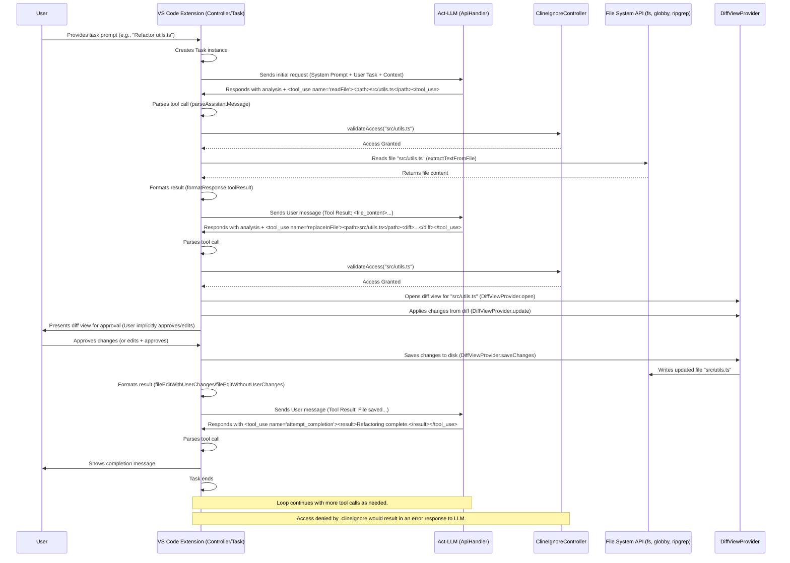

Okay, let's break down Cline's file system manipulation pipeline based on the provided source code.

## 1. High-level Overview

Cline interacts with the file system primarily through its **Act Mode**. When a user provides a task that requires file operations, the core `Task` class orchestrates the process. It sends the user's request along with contextual information (like file contents from `@` mentions or previous tool results) to the configured LLM via an `ApiHandler`.

The LLM is instructed (via the system prompt) to use specific tools for file system interactions. When the LLM responds with a tool call (e.g., `<read_file>`, `<write_to_file>`, `<replace_in_file>`), the `Task` class parses this response using `parseAssistantMessage`.

Before executing any file system operation requested by the LLM, Cline checks access permissions using the `ClineIgnoreController`, which respects patterns defined in a `.clineignore` file (similar to `.gitignore`). If access is permitted, the `Task` class invokes the appropriate integration function (e.g., reading content via `extractTextFromFile`, listing files via `listFiles`, searching via `regexSearchFiles`, writing/replacing via `DiffViewProvider`).

The result of the file operation (e.g., file content, list of files, success/error message) is then formatted using `formatResponse` and sent back to the LLM as a tool result in the *next* user message turn. This iterative loop continues until the LLM determines the task is complete and uses the `<attempt_completion>` tool. File writes/edits are staged in a `DiffViewProvider` and only committed to disk upon user approval or if auto-approval is enabled.

## 2. System-Prompt Template

The core instructions for file system interaction are embedded within the main system prompt defined in `src/core/prompts/system.ts`. Key relevant sections include:

```text
# Tool Use Formatting
Tool use is formatted using XML-style tags...
<tool_name>
<parameter1_name>value1</parameter1_name>
...
</tool_name>

# Tools

## read_file
Description: Request to read the contents of a file...
Parameters:
- path: (required) The path of the file to read (relative to the current working directory...)
Usage:
<read_file>
<path>File path here</path>
</read_file>

## write_to_file
Description: Request to write content to a file... If the file exists, it will be overwritten... If the file doesn't exist, it will be created...
Parameters:
- path: (required) The path of the file to write to...
- content: (required) The content to write... ALWAYS provide the COMPLETE intended content...
Usage:
<write_to_file>
<path>File path here</path>
<content>
Your file content here
</content>
</write_to_file>

## replace_in_file
Description: Request to replace sections of content in an existing file using SEARCH/REPLACE blocks...
Parameters:
- path: (required) The path of the file to modify...
- diff: (required) One or more SEARCH/REPLACE blocks following this exact format:
  ```
  <<<<<<< SEARCH
  [exact content to find]
  =======
  [new content to replace with]
  >>>>>>> REPLACE
  ```
  Critical rules:
  1. SEARCH content must match... EXACTLY...
  2. ...ONLY replace the first match occurrence...
  3. ...list them in the order they appear in the file.
  4. ...Keep SEARCH/REPLACE blocks concise...
  5. Special operations: To delete code: Use empty REPLACE section...
Usage:
<replace_in_file>
<path>File path here</path>
<diff>
Search and replace blocks here
</diff>
</replace_in_file>

## search_files
Description: Request to perform a regex search across files...
Parameters:
- path: (required) The path of the directory to search in...
- regex: (required) The regular expression pattern to search for...
- file_pattern: (optional) Glob pattern to filter files...
Usage:
<search_files>
<path>Directory path here</path>
<regex>Your regex pattern here</regex>
<file_pattern>file pattern here (optional)</file_pattern>
</search_files>

## list_files
Description: Request to list files and directories within the specified directory...
Parameters:
- path: (required) The path of the directory to list contents for...
- recursive: (optional) Whether to list files recursively...
Usage:
<list_files>
<path>Directory path here</path>
<recursive>true or false (optional)</recursive>
</list_files>

## list_code_definition_names
Description: Request to list definition names (classes, functions, methods, etc.) used in source code files at the top level...
Parameters:
- path: (required) The path of the directory...
Usage:
<list_code_definition_names>
<path>Directory path here</path>
</list_code_definition_names>

====

EDITING FILES
# write_to_file
## Purpose
- Create a new file, or overwrite the entire contents...
## When to Use
- Initial file creation...
- Overwriting large boilerplate files...
- When... replace_in_file unwieldy...
- When you need to completely restructure...

# replace_in_file
## Purpose
- Make targeted edits... without overwriting the entire file.
## When to Use
- Small, localized changes...
- Targeted improvements...
- Especially useful for long files...

# Choosing the Appropriate Tool
- Default to replace_in_file for most changes...
- Use write_to_file when: Creating new files, extensive changes, complete reorganization, small file with many changes...

# Auto-formatting Considerations
- After using either tool, the user's editor may automatically format the file...
- ...Use this final state as your reference point for any subsequent edits... SEARCH blocks... require the content to match what's in the file exactly.

====

RULES
- Your current working directory is: ${cwd.toPosix()}
- You cannot `cd` into a different directory... You are stuck operating from '${cwd.toPosix()}'...
- When creating a new project... organize all new files within a dedicated project directory...
- When you want to modify a file, use the replace_in_file or write_to_file tool directly... You do not need to display the changes before using the tool.
- It is critical you wait for the user's response after each tool use... Never assume the success of a tool use without explicit confirmation...
- The user may provide a file's contents directly in their message, in which case you shouldn't use the read_file tool...
- When using the replace_in_file tool, you must include complete lines in your SEARCH blocks...
- When using the replace_in_file tool, if you use multiple SEARCH/REPLACE blocks, list them in the order they appear in the file.

====

SYSTEM INFORMATION
...
Current Working Directory: ${cwd.toPosix()}

```

Additionally, user-defined instructions from `.clinerules` files (global and local) and `.clineignore` patterns are appended via functions in `src/core/context/instructions/user-instructions/cline-rules.ts` and formatted using helpers in `src/core/prompts/responses.ts`.

## 3. Registered Tools

| Name                       | Purpose                                                                 | Parameters                                                               | Returns                                      |
| :------------------------- | :---------------------------------------------------------------------- | :----------------------------------------------------------------------- | :------------------------------------------- |
| `readFile`                 | Reads the content of a specific file.                                   | `path` (string, required)                                                | File content (string) or error message.      |
| `writeFile`                | Creates a new file or overwrites an existing one with given content.    | `path` (string, required), `content` (string, required)                  | Confirmation message or error message.       |
| `replaceInFile`            | Makes targeted edits to an existing file using diff blocks.             | `path` (string, required), `diff` (string, required)                     | Confirmation message or error message.       |
| `listFiles`                | Lists files and directories within a specified path.                    | `path` (string, required), `recursive` (boolean, optional)               | List of files/directories or error message.  |
| `searchFiles`              | Performs a regex search within files in a directory.                    | `path` (string, required), `regex` (string, required), `filePattern` (string, optional) | Search results with context or error message. |
| `listCodeDefinitionNames`  | Lists top-level code definitions (classes, functions) in a directory. | `path` (string, required)                                                | Formatted list of definitions or error msg.  |

*(Note: `executeCommand` can also manipulate files indirectly, but these are the primary dedicated FS tools)*

## 4. Interaction Sequence (Mermaid)



## 5. Error Handling

Cline employs several strategies for handling file system errors:

1.  **Access Control (`.clineignore`):** Before any file system access (read, write, list, search), the `ClineIgnoreController` checks if the target path is excluded by `.clineignore` rules (`validateAccess`). If access is denied, an error message (`formatResponse.clineIgnoreError`) is sent back to the LLM, preventing the operation. (See `src/core/task/index.ts` tool handling).
2.  **Tool Parameter Validation:** The `Task` class checks for required parameters (e.g., `path`, `content`, `diff`) before executing a tool. If a required parameter is missing (often due to incomplete LLM streaming or parsing issues), it sends an error back to the LLM (`formatResponse.missingToolParameterError`) and increments a `consecutiveMistakeCount`. (See `src/core/task/index.ts`).
3.  **File System Errors:** Standard Node.js `fs` errors (e.g., file not found, permission denied) during read/write/list operations are caught within the respective tool execution logic (e.g., in `extractTextFromFile`, `listFiles`). These errors are formatted using `formatResponse.toolError` and sent back to the LLM.
4.  **Diff Application Errors:** The `constructNewFileContent` function within `src/core/assistant-message/diff.ts` can throw an error if a `SEARCH` block in a `replace_in_file` diff doesn't match the original content. This error is caught in the `Task` class, a specific error message (`formatResponse.diffError`) is generated, the `DiffViewProvider` reverts changes, and the error is sent to the LLM. Telemetry is captured (`telemetryService.captureDiffEditFailure`). (See `src/core/task/index.ts`).
5.  **Consecutive Mistakes:** The `Task` class tracks `consecutiveMistakeCount`. If it reaches a threshold (e.g., 3), it assumes the LLM is stuck or malfunctioning and sends a specific `mistake_limit_reached` message to the user/webview, potentially asking for guidance.
6.  **General Error Logging:** Uncaught errors or unexpected issues might be logged via the `Logger` and potentially reported via `ErrorService` (Sentry) if telemetry is enabled.

Recovery typically involves informing the LLM about the specific error and providing context (like the original file content in case of a diff error) so it can retry the operation with corrected parameters or a different approach.

## 6. Key APIs & Libraries

*   **Node.js `fs/promises`:** Used for fundamental file operations like reading (`fs.readFile`), writing (`fs.writeFile`), checking existence (`fs.access`), getting stats (`fs.stat`), creating directories (`fs.mkdir`), renaming (`fs.rename`), and deleting (`fs.unlink`, `fs.rmdir`). (Used across various files, directly or indirectly).
*   **Node.js `path`:** Used extensively for resolving, normalizing, and manipulating file paths cross-platform. (Used across many files).
*   **`globby`:** Used by `listFiles` (`src/services/glob/list-files.ts`) for powerful file and directory listing with glob patterns and ignore capabilities.
*   **`ripgrep` (via wrapper):** Used by `regexSearchFiles` (`src/services/ripgrep/index.ts`) for fast, regex-based file content searching, respecting `.gitignore`.
*   **`ignore`:** Used by `ClineIgnoreController` (`src/core/ignore/ClineIgnoreController.ts`) to parse `.clineignore` files and check paths against ignore patterns.
*   **VS Code API (`vscode.workspace.fs`, `vscode.Uri`, `vscode.TextDocument`):** While the core logic aims for Node.js compatibility, interactions like saving files modified in the `DiffViewProvider` (`src/integrations/editor/DiffViewProvider.ts`) use `vscode.workspace.applyEdit` and `document.save()`. `vscode.workspace.workspaceFolders` is used to determine the `cwd`.
*   **`diff` (npm package):** Used by `DiffViewProvider` and `formatResponse` to generate textual diffs when the user edits Cline's proposed changes.

## 7. Port-to-CLI Considerations

*   **VS Code API Dependencies:**
    *   **Workspace Context:** The CLI will need a way to determine the current working directory (e.g., command-line argument, current directory). Functions like `getWorkspacePath` need replacement.
    *   **Diff View:** The `DiffViewProvider` relies heavily on VS Code's editor and diff capabilities. A CLI version would need an alternative way to present diffs (e.g., printing standard `diff` output to the console, using a TUI library like `blessed` or `ink`, or opening an external diff tool). User editing during diff approval would need a different mechanism (e.g., opening the file in `$EDITOR`).
    *   **State Management:** Global/Workspace/Secret state (`src/core/storage/state.ts`) needs replacement (e.g., config files like `.json` or `.yaml`, environment variables).
    *   **Notifications:** `vscode.window.showErrorMessage` etc. must be replaced with console output (stderr/stdout).
    *   **File Watching:** VS Code's file watchers used by `ClineIgnoreController` and `WorkspaceTracker` need replacement (e.g., using `chokidar`).
*   **User Interaction:** The approval flow for tool use (currently via webview buttons) needs a CLI equivalent (e.g., interactive prompts using `inquirer`). Auto-approval could be managed via CLI flags or config files.
*   **`.clineignore`:** This mechanism should port relatively easily as it uses the standard `ignore` library. The controller just needs the correct `cwd`.
*   **FS Operations:** The core Node.js `fs` operations are directly usable. Libraries like `globby` and the `ripgrep` wrapper should also work outside VS Code, assuming `ripgrep` is available in the system's PATH.
*   **Sandboxing/Security:** Running as a CLI tool grants broader file system access than a VS Code extension might implicitly have. Careful handling of paths and permissions is crucial. The `.clineignore` becomes even more important.
*   **Checkpoints:** The Git-based checkpoint system (`CheckpointTracker`) uses `simple-git` and filesystem operations. It could potentially be ported, but managing the shadow git repository location and linking it to the correct workspace might require more explicit configuration in a CLI context compared to using VS Code's global storage path.
*   **Mentions:** Parsing `@` mentions for files (`src/core/mentions/index.ts`) works on text, but the *context* for resolving those mentions (e.g., `@problems`, `@terminal`) comes from VS Code APIs and would need CLI-specific replacements or be omitted.
