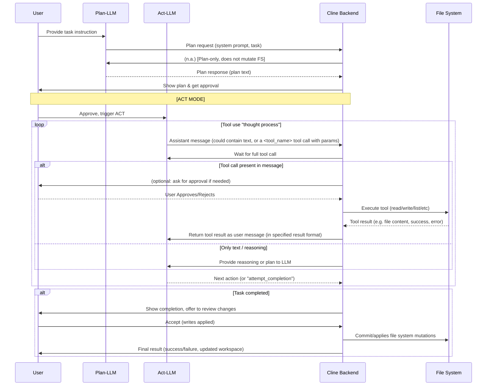

## 1. High‑level Overview

Cline transforms high-level developer instructions into LLM-powered plans, which are then “acted out” in the workspace using tool calls for code automation. File system access (read, write, list, search, etc.) is mediated through explicit tool function-calls that the LLM must invoke. Cline strictly separates "Plan" (reason about what should be done; _no actual changes_) and "Act" (execute and apply changes) modes to provide safety, compositionality, and transparency.

Key backend pipeline (for file system mutation):

1. **User Prompt**: Developer submits a high-level request ("Add logging to all utils", "Refactor X function", etc.).
2. **Plan Mode**: LLM generates/explains a plan using the system prompt; no code is yet changed.
3. **Act Mode**: Another LLM run (possibly a different model for speed/cost) steps through the proposed plan, invoking function-calls (tools) to carry out workspace edits.
4. **Tool Execution and Mediation**: The LLM cannot see or edit files directly; instead, it calls file-manipulation tools (via function-calling API/JSON spec). The extension/server mediates the tool execution, applies changes, and confirms or rejects results.
5. **Approval, Error Handling, Safeguards**: By default, tool calls (especially mutations) require user approval unless auto‑approval is configured. Failures, missing parameters, or unsafe actions are trapped and surfaced for intervention.

When porting to CLI, the same “user prompt → plan → act (file changes)” logic applies, but approvals and UX cues will be implemented via CLI interaction or automation.

---

## 2. System‑Prompt Template

```text
You are Cline, a highly skilled software engineer with extensive knowledge in many programming languages, frameworks, design patterns, and best practices.

====

TOOL USE

You have access to a set of tools that are executed upon the user's approval. You can use one tool per message, and will receive the result of that tool use in the user's response. You use tools step-by-step to accomplish a given task, with each tool use informed by the result of the previous tool use.

# Tool Use Formatting

Tool use is formatted using XML-style tags. The tool name is enclosed in opening and closing tags, and each parameter is similarly enclosed within its own set of tags. Here's the structure:

<tool_name>
<parameter1_name>value1</parameter1_name>
<parameter2_name>value2</parameter2_name>
...
</tool_name>

[...abbreviated...]

# Tools

## execute_command
Description: Request to execute a CLI command on the system.
Parameters:
- command: (required)
- requires_approval: (required)

## read_file
Description: Request to read the contents of a file at the specified path.
Parameters:
- path: (required)

## write_to_file
Description: Request to write content to a file at the specified path.
Parameters:
- path: (required)
- content: (required, full content to write)

## replace_in_file
Description: Request to replace sections of content in an existing file using SEARCH/REPLACE blocks that define exact changes to specific parts of the file.
Parameters:
- path: (required)
- diff: (required, multi-block format)

## list_files
Description: Request to list files and directories within the specified directory.
Parameters:
- path: (required)
- recursive: (optional)

## list_code_definition_names
Description: Request to list top-level source code definitions in a directory.
Parameters:
- path: (required)

## search_files
Description: Request to perform a regex search across files in a specified directory.
Parameters:
- path: (required)
- regex: (required)
- file_pattern: (optional)

[...see system-prompt for the full detailed language and all tool specs...]

ALWAYS adhere to this format for the tool use to ensure proper parsing and execution. Only one tool per message.

====
```

This prompt strictly instructs the LLM it cannot read/write files or run commands directly except _via these tool invocations_.

---

## 3. Registered Tools

| Name                         | Purpose                                                                | Parameters                                               | Returns                                     |
| ---------------------------- | ---------------------------------------------------------------------- | -------------------------------------------------------- | ------------------------------------------- |
| `read_file`                  | Read the contents of a file                                            | `path: string`                                           | file contents as string                     |
| `write_to_file`              | Write content to (overwrite/create) a file                             | `path: string`, `content: string`                        | confirms, error if failure                  |
| `replace_in_file`            | Replace parts of an existing file via diff (immutable, block-by-block) | `path: string`, `diff: string`                           | new file content, error if mismatch/failure |
| `list_files`                 | List files/dirs (optionally recursive) in a directory                  | `path: string`, `recursive?: bool`                       | file/directory listing as string            |
| `list_code_definition_names` | List top-level code definitions using TreeSitter                       | `path: string`                                           | function/class/module names, 1 per line     |
| `search_files`               | Regex search files/folders by pattern                                  | `path: string`, `regex: string`, `file_pattern?: string` | search results (matches with context)       |
| `execute_command`            | Run a shell command (with user approval or auto-approval)              | `command: string`, `requires_approval: bool`             | command exit status, stdout/stderr          |

**Tool Definition Schema (for each tool)**:

- Tool name (XML tag in LLM prompt: `<read_file>...</read_file>`)
- All parameters are string-typed.
- Tool semantically requires explicit parameters, which Cline backend validates.

**Registration Example (code, e.g. in backend):**

```typescript
const toolDefinitions = [
  {
    name: "read_file",
    params: ["path"],
    handler: async ({ path }) => { return fs.readFile(path, "utf8") }
  },
  ... // etc.
]
```

**Tool registration with LLM** is via the system prompt and JSON/XML parsing of outputs. Cline parses each assistant message for tool calls, validates/executes, then returns the tool result as the next user message turn.

---

## 4. Interaction Sequence (Mermaid)



**Short textual timeline**:

1. User prompt
2. Plan-mode LLM runs: generates a plan, _no file edits yet_
3. User triggers Act-mode (auto or via approval)
4. For each LLM/tool step:
   - LLM asks for tool use via structured tool call (XML, JSON)
   - Extension mediates approval, executes only if permitted
   - Extension applies file system mutation, returns result
   - LLM proceeds or reacts
5. On completion: all file writes performed, summary/results presented.

---

## 5. Error Handling

**Tool Failure Detection** (e.g. in `@core/task/index.ts`):

- All tool handlers wrap execution in try/catch. Errors are surfaced to the user and to the LLM via explicit tool error result messages.
- Common failure modes:
  - File not found or permissions error (read/write)
  - Diff mismatch when using `replace_in_file` (output format enforces position/original match)
  - Invalid or missing parameters (tool calls with missing required args return error to LLM)
  - Clineignore/cline rules: If tool request targets an ignored or forbidden path, the tool handler immediately blocks with error (`clineignore_error`).
- If the LLM returns malformed or incomplete tool calls (missing parameters, wrong tag format, no tool return in message, etc.), Cline rejects and returns an error message for re-try.
- Infinite loops, excessive errors, or repeated mistakes (e.g., 3 consecutive tool failures) are caught and surfaced to user and/or LLM with guidance options to restart, retry, or update their approach.

**Safeguard Highlights:**

- User approval can be enforced for _all_ file/edit commands unless auto-approval is enabled per tool class.
- `.clineignore` blocks access at path/pattern level; violations are intercepted before FS mutation.
- All mutations are applied atomically and logged. On user rejection, no file changes occur.
- Cline can recover from partial failures (e.g., a failed tool call does not kill the agent, but returns an explicit error block and restarts the step).

---

## 6. Key APIs & Libraries

- **Filesystem I/O**:
  - **fs/promises** (read, write, stat, readdir, unlink, mkdir): for read/write/create/list actions
  - **@utils/fs**: helpers like `fileExistsAtPath`, `createDirectoriesForFile`, etc.
  - **isBinaryFile**: binary-safe reading
- **Process Execution**:
  - **execa**: for robust CLI subprocess/command execution (cross-platform).
- **Safety Enforcement**:
  - **@core/ignore/ClineIgnoreController**: implements `.clineignore` patterns.
- **Text Extraction / Formats**:
  - **pdf-parse**, **mammoth**, **iconv-lite**: for text extraction from varied file types.
- **Diff logic**:
  - **diff**: for `replace_in_file` tool (search/replace blocks, chunk-level patching of files).
  - @core/assistant-message/diff.ts: core logic for diff application, enforcement, and error feedback to LLM.
- **Tree-sitter**: code definition search (list_code_definition_names).
- **Cli/Server bridge**:
  - In test mode, VSCode's server hosts http endpoint for CLI to submit user prompts, get results, and orchestrate a full tool-usage workflow.

---

## 7. Port‑to‑CLI Considerations

- **No VSCode APIs** (UI, editor buffer, notifications, tab tracking, etc.): You must ensure all file I/O and process use is via Node.js or cross-platform shell tools.
- **Approval/Rejection** ("ask" function): CLI must provide equivalent mediation, e.g., interactive prompts or CLI flags for auto-approve.
- **Workspace detection**: CLI will need to set `cwd` (working directory) explicitly, and manage the lifecycle of the session directory and clineignore logic.
- **.clineignore / Rules**: Behaviors must be replicated: ensure all file access is checked for allowed paths/patterns.
- **Plan/Act separation**: Replicate or simulate the Plan→Act gating, even if automatic (fast-track).
- **Diff/patch application**: Use the same implementation for `replace_in_file`—order, anchoring, strict matching must be enforced in CLI as in VS Code.
- **Error handling/reporting**: In CLI, you must directly propagate tool errors, show intermediate status, and allow retry/reject options.
- **History/undo/checkpointing**: VSCode uses git for undo; in CLI, you may want to shell out to `git` or at least checkpoint files for undo/retry.
- **Multi-file**: The tool logic is stateless in that all mutations are explicit; so you can adapt it to batch or script processing as needed.

---

This backend pipeline is strictly decoupled from UI logic; all file access, edits, error/retry, and gating should map 1:1 to API calls in the above flow.

```
If you need **code references** for registration, error handling injection, or tool schema shape, request them for a tool-by-tool basis.
```
